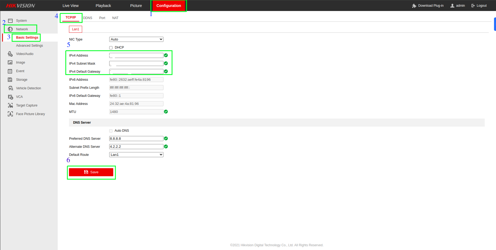

# Network

## **Configuring System Network**

### **CLI**

**Step 1**: Open the terminal on your system.

**Step 2**: Run the command to list your network interfaces:

``` 
nmcli device
```
This will show you the names of your network interfaces, e.g. **<span style="color:blue">enp0s3</span>**, **<span style="color:blue">wlp2s0</span>**, etc.

**Step 3**: Run the following command to edit the connection settings for your desired interface  
(replace **<span style="color:blue">enp0s3</span>** with your interface name):
```
nmcli connection edit enp0s3
```
**Step 4**: In the **<span style="color:blue">nmcli</span>** interactive prompt, set the new IP address, subnet mask, gateway, and DNS servers:
```
nmcli> set ipv4.method manual
nmcli> set ipv4.addresses 192.168.1.100/24
nmcli> set ipv4.gateway 192.168.1.1
nmcli> set ipv4.dns 8.8.8.8,8.8.4.4
nmcli> quit
```
**Note**: Replace the IP addresses, subnet mask, gateway, and DNS servers with your desired values.

**Step 5**: Activate the new configuration:
```
nmcli connection up enp0s3
```

**Step 6**: Verify your new IP Address configuration 
```
ip addr show enp0s3
```
If everything went well, you should see your new IP address.

### **GUI**

**Step 1**: **Open Settings:**

   - Click on the system menu at the top right corner of your screen.
   - Select "Settings" from the dropdown menu.


**Step 2**: **Navigate to Network Settings:**

   - In the "Settings" window, find and click on the "Network" section on the left sidebar.
   - In the "Network" settings, under the "Wired" section, click on the settings icon (gear icon) next to the "Wired" connection.


**Step 3**:  **Network Configuration**

- In the new window that appears, click on the "IPv4" tab to open the IPv4 settings.
- Change the "IPv4 Method" from "Automatic (DHCP)" to "Manual" by selecting the "Manual" radio button.
- Under the "Addresses" section, you need to provide the following information:
     - **Address:** Enter the IP address you want to assign to your machine. For example, `192.168.0.101`.
     - **Netmask:** Enter the subnet mask. In this example, it's `255.255.255.0`.
     - **Gateway:** Enter the gateway address, typically the address of your router. For this example, it is `192.168.0.1`.
- Once you've entered all the necessary information, click the "Apply" button at the top right corner of the window to save the changes.


**Step 4**: **Reconnect the Wired Connection:**

   - Ensure your cable is plugged in if not already.
   - If the cable is unplugged, plug it back in, and your system should now use the manual IP configuration you set.

## **Connect two Different Network in GPU**

### **CLI**

**Step 1**: **Identify Network Interfaces:**

   - Identify your network interfaces to distinguish between the USB dongle and the LAN connection.

```
ip link show
```
   - **Note:** the interface names (e.g., eth0, eth1, wlan0, usb0).

 **Step 2: Configure Static IP for USB Dongle (Internet Access)**

 Assuming your USB dongle is recognized as usb0, configure it with a static IP address.

   - Open the Netplan configuration file
   
```
sudo nano /etc/netplan/01-netcfg.yaml    
```

   - Add the following configuration for the USB dongle.

```
network:
   version: 2
   ethernets:
      usb0:
      addresses:
         - 192.168.2.10/24    # Example: Replace with your desired static IP address
      gateway4: 192.168.2.1   # Example: Replace with your gateway
      nameservers:
         addresses:
            - 8.8.8.8
            - 8.8.4.4
```

 **Step 3: Configure Static IP for LAN Connection (Camera Access)**

 Assuming your LAN interface is eth0, configure it with a static IP address.
 
   - Open the Netplan configuration file.

```
sudo nano /etc/netplan/01-netcfg.yaml
```
   - Add the following configuration for the LAN connection

```
network:
  version: 2
  ethernets:
    eth0:
      addresses:
        - 192.168.1.10/24     # Example: Replace with your desired static IP address
      gateway4: 192.168.1.1   # Example: Replace with your gateway
      nameservers:
        addresses:
          - 8.8.8.8
          - 8.8.4.4
```

**Step 4: Apply the Netplan Configuration**

   - Apply the Netplan configuration to enable the new network settings.

```
sudo netplan apply
```

**Step 4: Verify Connections**

Ensure both interfaces are correctly configured and active.

   - Check the status of the network interfaces.

```
ip a
```

   - Test the internet connection (via USB dongle).

```
ping -c 4 google.com
```

   - Test the camera network connection (via LAN)

```
ping -c 4 192.168.1.20
```
**Troubleshooting**

If you encounter issues, you can troubleshoot using the following commands:
   - Check Netplan configuration:

```
sudo netplan try
```

   - Restart network services:

```
sudo systemctl restart systemd-networkd
sudo systemctl restart NetworkManager
```

   - Review system logs for network-related errors:

```
sudo journalctl -u systemd-networkd
sudo journalctl -u NetworkManager
```
**Example Netplan Configuration File**

Here is an example of how your /etc/netplan/01-netcfg.yaml file should look with both configurations:

```
network:
  version: 2
  ethernets:
    usb0:
      addresses:
        - 192.168.2.10/24  # Example: Replace with your desired static IP address
      gateway4: 192.168.2.1  # Example: Replace with your gateway
      nameservers:
        addresses:
          - 8.8.8.8
          - 8.8.4.4
    eth0:
      addresses:
        - 192.168.1.10/24  # Example: Replace with your desired static IP address
      gateway4: 192.168.1.1  # Example: Replace with your gateway
      nameservers:
        addresses:
          - 8.8.8.8
          - 8.8.4.4

```

### **GUI**

**Step 1: Open Network Settings**

   - Click on the Network icon in the system tray.
   - Select Settings.

**Step 2: Configure LAN Connection for Camera Access**

   - Open Wired Settings
   - Click on the gear icon next to your wired connection (e.g., eth0).


**IPv4 Settings**

   - Go to the IPv4 tab.
   - Select Manual for the IPv4 Method.
   - Under Addresses, enter:
      - **Address**: 192.168.1.10 (Replace with your desired static IP)
      - **Netmask**: 255.255.255.0 (Common subnet mask)
      - **Gateway**: 192.168.1.1 (Your network gateway)
   - Under DNS, enter:
      - 8.8.8.8, 4.2.2.2 (Public DNS servers)
   - Click Apply to save the settings.
 
    

**Step 3:  Configure USB Dongle for Internet Access**
   
   - Open USB Ethernet Settings:
      - In the Network settings, find your USB Ethernet connection (it might be listed under a different name depending on your USB dongle).
   - Edit USB Ethernet Connection:
      - Click on the gear icon next to your USB Ethernet connection (e.g., usb0).

 

**IPv4 Settings**

   - Select Manual for the IPv4 Method.
   - Under Addresses, enter:
   - Go to the IPv4 tab.
      - **Address**: 192.168.2.10 (Replace with your desired static IP)
      - **Netmask**: 255.255.255.0 (Common subnet mask)
      - **Gateway**: 192.168.2.1 (Your network gateway)
   - Under DNS, enter:
      - 8.8.8.8, 4.2.2.2 (Public DNS servers)
   - Click Apply to save the settings.


**Step 4: Verify Network Connections**

   - Run the following command in the terminal:

```
ping -c 4 google.com
```

Ensure you receive responses.

   - Test Camera Network Connection (via LAN):
   - Ping the camera's IP address:

```
ping -c 4 <camera-ip-address>
```

   - Replace *camera-ip-address* with the actual IP address of your camera.

## **CCTV Configuration** 

   - When configuring CCTV for video analytics, follow these steps to ensure proper setup and functionality

   1. ***Ensure Network Compatibility***
   
   - **Check Network Alignment:** Verify that the CCTV network is on the same network as the GPU.
   - **Adjust GPU Network Configuration:** If the GPU is not on the same network as the CCTV, reconfigure the GPU to be in the same network as the CCTV.
   - **DVR Network Configuration:** 
      
      If there is a need to configure the DVR network, follow these steps:

      - Log in to the DVR via its IP address.
  #Add Image here 
      - Go to the Configuration section.
      - Navigate to Network.
      - Select Basic Setting.
      - Change the IP address as required.

 


2. ***Configure DVR Video Encoding Settings***

       **Access DVR Settings:**

      - Open a web browser and enter the IP address of the DVR.
      - Log in using the appropriate username and password.

      **Navigate to Configuration:**

      - Go to the Configuration section.
      - Select Video/Audio to access the encoding settings.

      **Set Encoding Parameters:**

    - Adjust the video encoding settings as required. 
   
      **Note:-**The specific settings will depend on your video analytics requirements and the capabilities of your DVR.

## **VPN**

A Virtual Private Network (VPN) is a service that encrypts your internet connection and routes it through a remote server, masking your IP address and enhancing your online privacy and security. It allows you to access the internet as if you were in a different location, bypassing geo-restrictions and protecting your data from hackers and surveillance

### **Tunnel VPN**

A Tunnel VPN (Virtual Private Network) refers to the method of securely transmitting data between two points (e.g., your device and a VPN server) by creating an encrypted "tunnel" over a public network such as the internet. This tunnel ensures that the data sent and received is protected from interception and unauthorized access, thereby enhancing privacy and security.

Key features of Tunnel VPN include:

- Encryption: Data is encrypted, making it unreadable to anyone who intercepts it.
- Authentication: Only authorized users can establish a connection through the tunnel.
- Data Integrity: Ensures that data is not tampered with during transmission.

Tunnel VPNs are commonly used to secure connections over public Wi-Fi, access region-restricted content, and protect sensitive information from cyber threats.


Configuring a Tunnel VPN using FortiClient involves several steps, including installing the software, configuring the VPN settings, and connecting to the VPN. 

Below is a step-by-step guide to help you configure FortiClient for Tunnel VPN on your system:


**Step 1:** Download and Install FortiClient

**Download FortiClient:**

   - Visit the Fortinet website and navigate to the FortiClient download page.

   - Choose the appropriate version for your operating system (Windows, macOS, Linux, etc.).

**Install FortiClient:**

   - Run the installer file you downloaded.

   - Follow the on-screen instructions to complete the installation process.

**Step 2:** Configure VPN Settings

**Open FortiClient:**

   - Launch the FortiClient application.

**Access VPN Configuration:**

   - On the FortiClient main screen, select the "Remote Access" tab.

**Create a New VPN Connection:**

   - Click on the "Configure VPN" or "New Connection" button.
   - Choose "SSL-VPN" or "IPsec VPN" based on your network's configuration.

**Enter VPN Details:**

   - Connection Name: Enter a name for your VPN connection (e.g., "Work VPN").
   - Remote Gateway: Enter the IP address or hostname of your VPN server.
   - Port: Use the default port or the one provided by your network administrator.
   - Username and Password: Enter your VPN credentials (provided by your network administrator).

**Save the Configuration:**

   - Click "Save" or "OK" to save your VPN settings.

**Step 3:** Connect to the VPN

**Connect to the VPN:**

   - On the FortiClient main screen, navigate to the "Remote Access" tab.
   - Select the VPN connection you created from the dropdown menu.
   - Click the "Connect" button.

**Authenticate:**

   - If prompted, enter your username and password.
   - Complete any additional authentication steps if required (e.g., two-factor authentication).

**Verify the Connection:**

   - Once connected, the FortiClient interface will show the status as "Connected".
   - You can now access resources on the remote network as if you were directly connected to it.

**Step 4:** Disconnect from the VPN

**Disconnect:**

   - When you are done using the VPN, go back to the FortiClient application.
   - Click the "Disconnect" button on the "Remote Access" tab.

